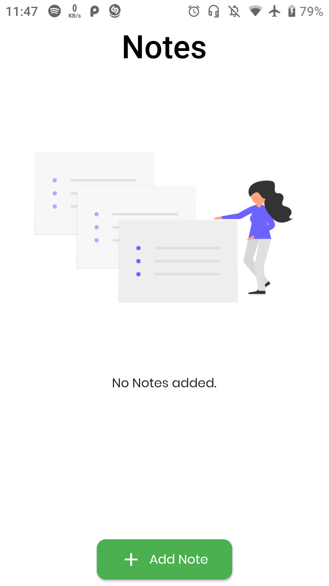
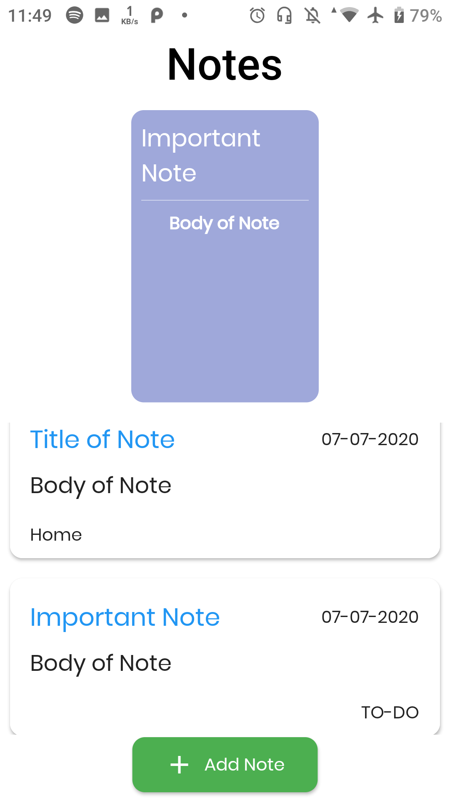
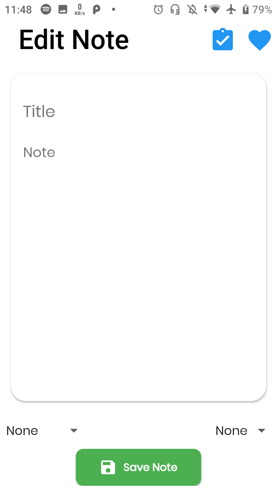
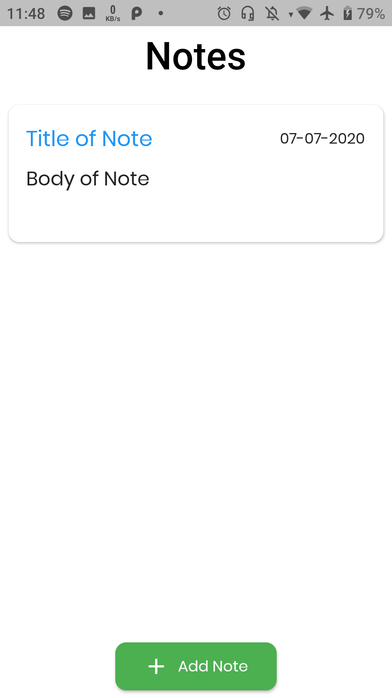

# Note Worthy

A minimal Note taking Application built using Flutter and Moor Library.
  
## About
Offline database to store important notes.

### The android app lets you:

- Add, edit important notes for further references. 
## Screenshots

### Home Screen

### Add Notes

## Permissions

App doesn't require any prior permissions.
## Contributing

Note Worthy app is a free and open source project. Any contributions are welcome. Here are a few ways you can help:
 * [Report bugs and make suggestions.](https://github.com/wallabag/android-app/issues)
 

## Credits  
Thanks to  Wanicon (https://flaticon.com/authors/wanicon) for the app icon.

## License

This application is released under GNU GPLv3 (see [LICENSE](LICENSE)).
Some of the used libraries are released under different licenses.

